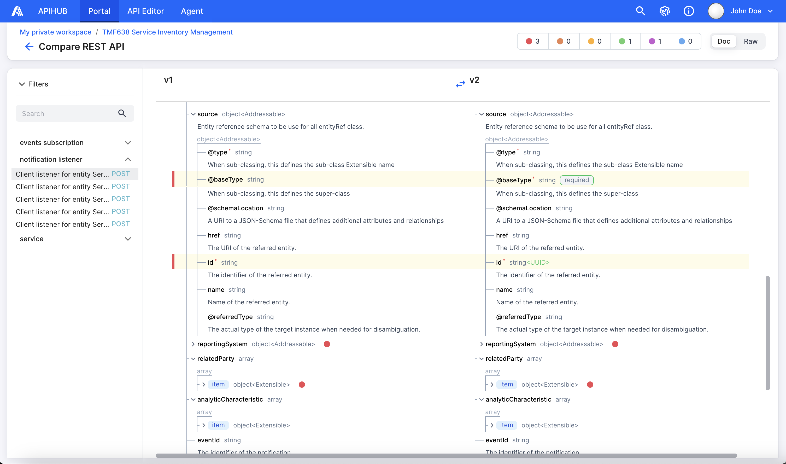

# APIHUB UI

<picture>
  <source media="(prefers-color-scheme: dark)" srcset="./docs/img/dark_mode_icon.svg">
  
</picture>

APIHUB is a comprehensive solution designed to achieve the following goals:
- Increase quality and completeness of API documentation.
- Provide a single point of truth for API documentation.
- Enable an API design-first approach.
- Automate API backward compatibility validation and integrate with CI process.

APIHUB consists of two main components:
- Portal
- Agent

**Portal** is centralized repository for storing and managing API specification. Portal allows you to:
- Upload API specifications, Markdown files and any other artifacts related to API.
- View API specifications and Markdown files in human-readable format.
- Compare API.
- Check backward compatibility of API.
- Track deprecated entities from API specifications.

Currently, Portal allows working with OpenAPI specification with versions 2.0 and 3.0, and GraphQL specifications and introspections of release October 2021.



For more information about Portal, please see the [user guide](./docs/Portal%20User%20Guide.md).

**Agent** is web-based interface to work with a runtime agent. Runtime agent is an application that runs within the Kubernetes environment. It allows you to discover exposed API documentation endpoints from services running on Kubernetes. Additionally, Agent provides the ability to make snapshots of discovered API specifications, validate API changes and promote API to Portal.


For more information about Agent, please see the [user guide](./docs/Agent%20User%20Guide.md).

## Development

### Running Portal locally

After `npm install`, you can run the Portal UI from the repository root or from `packages/portal`. Node.js **>= 24** is required (see `engines` in `package.json`).

From the **repository root**, both the mock backend and the Vite dev server start together:

```bash
npm run dev:portal
```

From **`packages/portal`**, run the backend and frontend in separate terminals when you need finer control.

#### Mock mode (full local backend)

Use this mode for everyday UI work without a deployed APIHUB backend. An Express mock server serves API responses from in-memory fixtures (packages, versions, AI Chat, and more).

1. `npm run dev:backend` — mock server on `http://localhost:3003` (override the port with `NODEJS_PORT`).
2. `npm run dev:frontend` — Vite dev server; proxies `/api`, `/playground`, and `/ws/v1` to the mock.

The dev server opens `/login` in the browser. Vite listens on its default port (typically **5173**); check the terminal output for the exact URL.

#### Proxy mode (real APIHUB backend)

Use this mode when you need real data, authentication, and backend behavior. Vite still serves the frontend with HMR, but API traffic is forwarded to a live APIHUB instance.

```bash
npm run proxy
```

In proxy mode, `/api`, `/playground`, and `/ws/v1` are proxied to the URL set as `proxyServer` in `packages/portal/vite.config.ts` (default: `http://host.docker.internal:8090`). The `/api-linter` prefix is proxied separately to `apiLinterProxyServer` (default: `http://host.docker.internal:8091`). Change these constants to match your local or remote backend.

For mixed development (real backend plus local mock for AI Chat and generated files), start `npm run dev:backend` and `npm run proxy` in parallel. See [packages/portal/server/README.md](packages/portal/server/README.md) for details and verification steps.

#### Preview mode (production build + proxy)

```bash
npm run preview
```

Builds the Portal (`npm run build` inside the script) and serves the production bundle via `vite preview` in proxy mode. Use this to validate the production build against a real backend.

| Script (in `packages/portal`) | Mode | Backend target |
| --- | --- | --- |
| `dev:backend` + `dev:frontend` | Mock | Local mock (`localhost:3003`) |
| `proxy` | Proxy | `proxyServer` in `vite.config.ts` |
| `preview` | Preview (proxy) | Same as `proxy` |

### Building the app locally

Modify `.npmrc` file by adding GitHub PAT (personal access token) with access to `read packages`.

The file content sample:

```ini
@netcracker:registry=https://npm.pkg.github.com/
//npm.pkg.github.com/:_authToken=ghp_XYZ
always-auth=true
```

```bash
npm install
npm run build
podman build -f Dockerfile.local .
```
