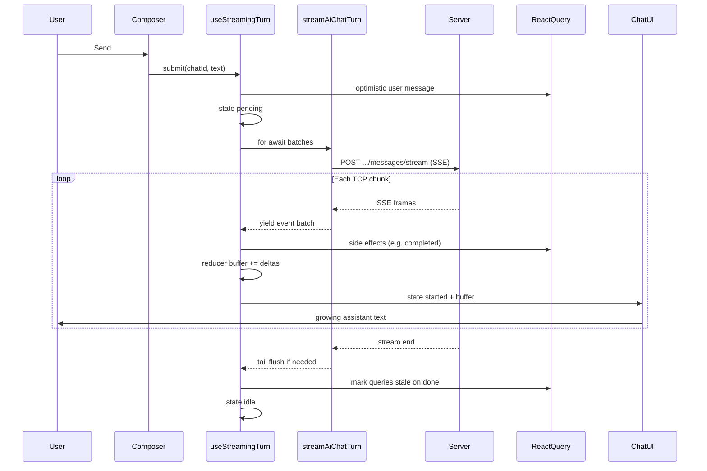
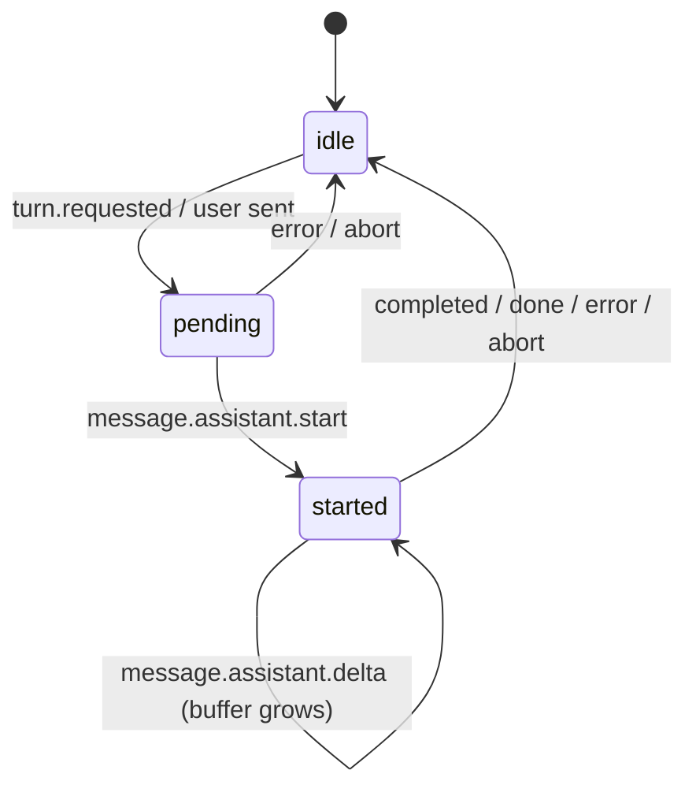

# AI Assistant - streaming (portal)

This folder contains the **live turn** path: sending a user message and showing the assistant reply while it is still being generated. Chat history, sidebar CRUD, and panel chrome live elsewhere under `AiAssistant/`.

The backend contract is documented in `qubership-apihub-backend/docs/feature_design/ai_assistant/ai-chat-frontend-contract.md` and `APIHUB_API.yaml` (tag **AI Chat**). This readme explains how the portal code uses that contract, in plain language.

## What "streaming" means here

A normal HTTP response arrives all at once. Here the server keeps the connection open and sends **small JSON messages over time** using **SSE** (Server-Sent Events): text chunks framed as `event:` / `data:` lines, separated by an empty line.

The UI does **not** wait for the full answer. It reads the stream, updates local state after each network chunk, and re-renders the assistant message as text grows.

You cannot use the browser `EventSource` API for this flow (it only supports GET). The portal uses `fetch()` plus a `ReadableStream` reader instead.

## Folder layout

| Path         | Role                                                               |
| ------------ | ------------------------------------------------------------------ |
| `transport/` | SSE parsing on an open stream body: bytes -> `AiChatStreamEvent[]` |
| `turn/`      | Turn state machine, React Query cache updates, submit/abort        |
| `markdown/`  | Live assistant Markdown (light render while streaming, full after) |

Shared API types (`AiChatStreamEvent`, messages, roles) stay in `../api/types.ts`. Stream POST and REST live in `../api/` (`requests.ts`, `client.ts`, `errors.ts`). Event name constants are in `../api/streamEvents.ts`.

UI wiring (message list, Thinking label, composer, jump button) stays in `../ui/chat/` and reads streaming state from `AiAssistantProvider` via context.

## End-to-end flow



## Layer 1 - API + transport

**HTTP:** `postAiChatMessageStream` in `../api/requests.ts` opens `POST /api/v1/ai-chat/chats/{chatId}/messages/stream` with `{ content, clientMessageId }` and returns the `Response` (or throws via `toAiChatHttpError`).

**SSE parsing:** `streamAiChatTurn` in `transport/sse.ts` (an **async generator** - `async function*` with `yield`). That pattern is rare in this repository but fits SSE well: the consumer pulls the next batch when ready instead of loading the whole body into memory.

Rough steps after the POST succeeds:

1. Read the response body in chunks (`reader.read()`).
2. `sseFramer.ts` splits the text buffer into complete SSE frames (frames end with `\n\n`).
3. Each frame's `data:` line is JSON -> `AiChatStreamEvent`.
4. **Yield once per TCP read** with all events parsed from that chunk (not one yield per event), so the turn layer can run one reducer update per chunk.
5. **Tail flush:** when the connection closes, the last bytes may not end with `\n\n`. The code appends `\n\n` once, parses any leftover frame, yields it, then stops - otherwise the last events could be lost.

Event types the turn layer cares about most:

| Event                         | Effect on UI state                                                          |
| ----------------------------- | --------------------------------------------------------------------------- |
| `message.assistant.start`     | Turn moves to "started", new assistant `messageId`                          |
| `message.assistant.delta`     | Append `delta` string to in-memory `buffer`                                 |
| `message.assistant.completed` | Final message written to React Query cache                                  |
| `error`                       | `fetch-error` toast (same event as REST) + partial answer kept if any       |
| `done`                        | Messages stale every turn; chat list stale only on first turn of a new chat |

Other events (`tool.started`, `tool.completed`, `context.compacted`, ...) are part of the backend contract but are **not** rendered yet. They still affect UX indirectly (see Thinking below).

## Layer 2 - Turn (`turn/`)

**Entry point:** `useStreamingTurn` - used from `AiAssistantProvider`, exposed on context as `streaming`.

### Turn states



| State     | What the user sees                                                   |
| --------- | -------------------------------------------------------------------- |
| `idle`    | No active generation                                                 |
| `pending` | User message shown; **Thinking** (waiting for first assistant token) |
| `started` | Live assistant bubble with text from `buffer`                        |

`streamingTurnReducer.ts` holds `buffer` and status. `processBatch` applies side effects (cache, toasts) then `dispatchTurn` (`stateRef` and React state both run `streamingTurnReducer`).

React Query:

- **Optimistic user message** is prepended immediately on send.
- On **completed**, the final assistant row is prepended to the cache.
- On **abort** or **error** with partial text, a partial assistant message may be saved.
- On **done**, `invalidateAiChatMessagesQuery(..., { refetchType: 'none' })` every turn: cache stays from SSE while the chat is open; refetch when the chat is opened again later.
- Chat list: `invalidateAiChatListQueries(..., { refetchType: 'none' })` only on the first turn after `createAiChat` (server auto-title is async after `done`).

### "Thinking" during tool / network gaps

While status is `started`, only `message.assistant.start` / `delta` refresh a "last text activity" timestamp. Other SSE events (tools, compaction) can leave the turn in `started` **without new text** for a while.

A **short poll** (see `STREAM_THINKING_POLL_MS` in `streamingTurnConstants.ts` and the comment in `useStreamingTurn`) shows the **Thinking** indicator if no assistant token arrived for ~1s. A single timeout per delta is not enough when non-text events arrive with no deltas in between.

### Constants

`streamingTurnConstants.ts` - turn statuses, reducer action names, error copy, thinking timings, optimistic ID prefix.

Jump-to-latest FAB phase constants live in `../ui/chat/chatScreenConstants.ts` (UI-only, not turn logic).

### Errors and the global handler

Portal-wide fetch errors go through `fetch-error` and `ExceptionSituationHandler`. For `status` 404 or 500 in the event it renders a **full-page** `ErrorPage`; otherwise a snackbar.

AI Chat uses the same event but sets `forceSnackbar: true` so 500/400 never replace the portal under the open panel (see `api/errors.ts`).

After the SSE read loop, if `isStreamingBusy(stateRef)` is still true, the hook shows a **warning** snackbar (`dispatchAiChatWarning`) with `AI_ASSISTANT_INCOMPLETE_STREAM_MESSAGE` - HTTP 200 but no terminal event (`completed`, `done`, or `error`). `dispatchTurn` updates `stateRef` in the same reducer pass as React `dispatch` so a normal `done` frame does not hit this guard before re-render.

| Failure                           | Who notifies                            | UI                                  |
| --------------------------------- | --------------------------------------- | ----------------------------------- |
| REST / stream POST HTTP error     | `toAiChatHttpError`                     | Snackbar (404: see below)           |
| SSE `error` frame                 | `dispatchAiChatFetchError`              | Snackbar (code/message from SSE)    |
| Stream body ends, turn still busy | post-stream guard in `useStreamingTurn` | Warning snackbar (incomplete reply) |

Mid-turn SSE errors are not HTTP failures; the turn layer dispatches `fetch-error` after parsing the frame.

### Stream HTTP 404 - local only

`POST .../messages/stream` may return **404** + `APIHUB-AI-3001` before any SSE byte (chat deleted, stale `chatId` in the panel, or send raced with delete). Global `fetch-error` with `status: 404` would show a full-portal **ErrorPage** under the open drawer - we skip that.

`toAiChatHttpError` does not dispatch on 404; `useStreamingTurn` catches `HttpError`, keeps any partial assistant text, clears caches for the `chatId`, and `resetActiveChat()` when it was active (welcome/history, no toast). Other HTTP statuses still use `dispatchAiChatFetchError` (`forceSnackbar: true`).

## Layer 3 - Live Markdown (`markdown/`)

While streaming, `ChatAssistantMessage` uses `AI_ASSISTANT_MARKDOWN_MODE.streaming`: GFM without syntax highlighting, via `CodeBlock` with header hidden.

When the turn ends, the same message renders in **full** mode (highlighting, copy button) using authoritative `content` from the cache after `completed`.

`normalizeStreamingMarkdown.ts` closes unfinished fenced code blocks during streaming so raw `` ``` `` lines do not flash on screen.

## What lives outside this folder

| Location                                    | Responsibility                                      |
| ------------------------------------------- | --------------------------------------------------- |
| `state/AiAssistantProvider.tsx`             | Creates `useStreamingTurn`, puts it on context      |
| `ui/chat/*`                                 | Message list, Thinking, composer, scroll / jump FAB |
| `ui/markdown/AiAssistantMarkdownViewer.tsx` | Shared Markdown viewer (history + stream)           |
| `api/*`                                     | REST client, paths, errors, stream POST, hooks      |
| `hooks/useAiAssistantDeleteChat.ts`         | Delete mutation + panel navigation on failure       |

## Mental model (one paragraph)

User sends -> optimistic user row + HTTP SSE stream opens -> each network chunk becomes a **batch of events** ->
reducer appends text to `buffer` -> chat UI shows a synthetic assistant message until `completed` replaces it with
the server message -> `done` marks messages stale (refetch when revisiting the chat); list stale on first turn of a new chat.

Stop aborts `fetch` and may keep partial text. The generator in `sse.ts` bridges network chunks and React; the turn
hook bridges events and UI/cache.

## Tests and mock coverage

| Case                                                             | Mock (`debug:*`)                                      | Automated test                                          |
| ---------------------------------------------------------------- | ----------------------------------------------------- | ------------------------------------------------------- |
| Happy path ends with `completed` + `done`                        | default / most scenarios                              | `ai-chat.spec.ts` happy path; reducer tests             |
| Stream ends without terminal SSE (real guard)                    | `debug:truncated-stream` (manual UI warning snackbar) | `ai-chat.spec.ts` asserts SSE has no `completed`/`done` |
| SSE `error` frame                                                | `debug:error`                                         | `ai-chat.spec.ts`                                       |
| False snackbar when `done` arrived but `stateRef` lagged (fixed) | not reproducible on mock                              | `streamingTurnPostStream.unit-test.ts`                  |

Unit files: `sseFramer.unit-test.ts`, `streamingTurnReducer.unit-test.ts`, `streamingTurnPostStream.unit-test.ts`. Mock scenario table: `packages/portal/server/README.md`.
